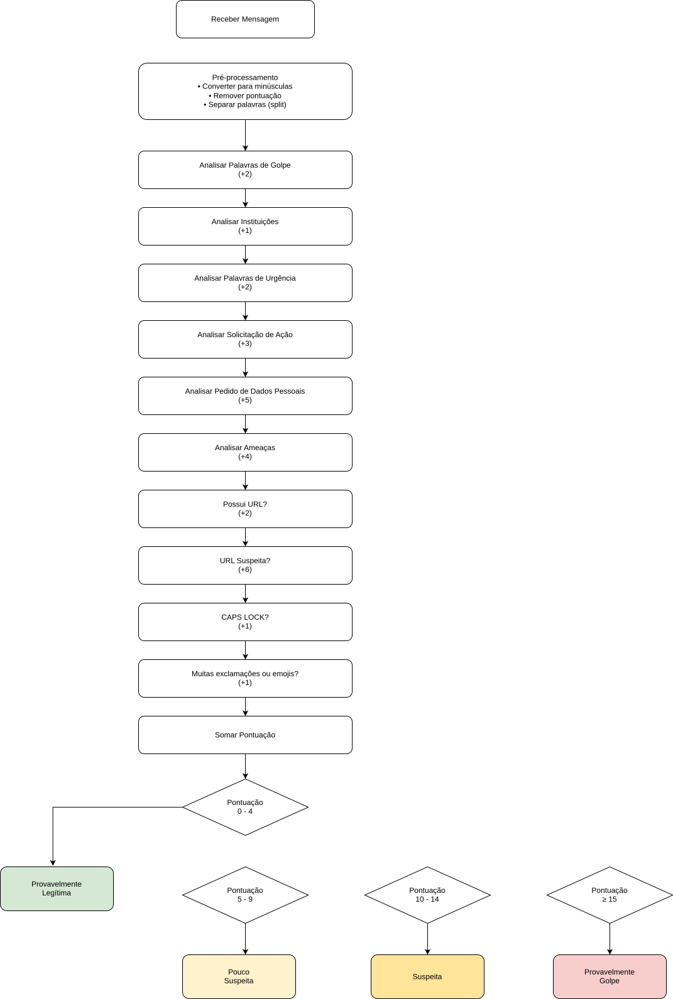

# PareceFalso 🔎
Nosso projeto tem como intuito, criar uma solução capaz de identificar mensagens e URLs suspeitas características de golpe.
Além disso, temos como objetivo também apresentar dicas e orientações para não cair em golpes

## Tecnologias utilizadas 🖥️
- Java (back-end)
  IDE: IntelliJ
- Miro (guiding questions)

## Funcionalidades dentro do programa ⚙️
- Menu interativo no próprio terminal, utilizando o laço de repetição While e a estrutura de decisão Switch
- Separamos três niveis de gravidade se a mensagem for suspeita: Pouco suspeita, Suspeita e Provavelmente Golpe. Se a mensagem não for suspeita, irá ser categorizada como "Provavelmente Legítima"
- Criamos listas com palavras características de golpe no arquivo "PalavrasGolpe.java"

## Fluxo do Sistema 📊

